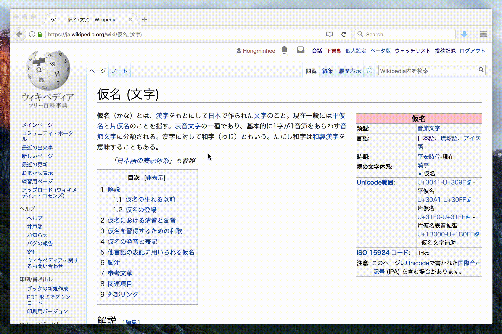

Wikipedia Kana Romanizer
========================

This userscript transliterates Japanese hiragana (平仮名) and katakana (平仮名)
text into Roman script (ローマ字) and renders *both* of the original text and
the transliteration using `<ruby>` tag.

[Install the script][0]
--------------------------------------------------------

It requires [Greasemonkey][1] on Firefox and [Tampermonkey][2] on
Chrome/Safari/Opera/Edge.

[0]: https://github.com/dahlia/wikipedia-kana-romanizer/raw/master/wikipedia_kana_romanizer.user.js
[1]: http://www.greasespot.net/
[2]: https://tampermonkey.net/

Distribution
------------

Written by [Hong Minhee][3] and distributed under [GPLv3][4] or later.

[3]: https://hongminhee.org/
[4]: https://www.gnu.org/licenses/gpl-3.0.html

